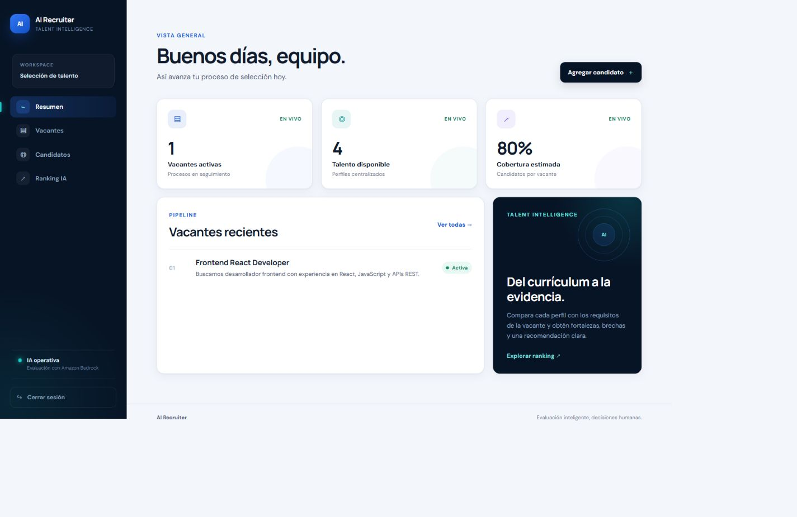
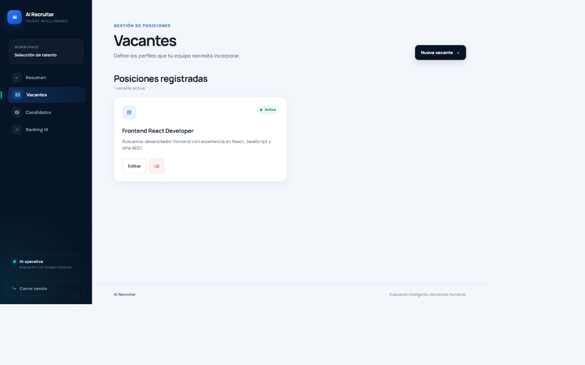
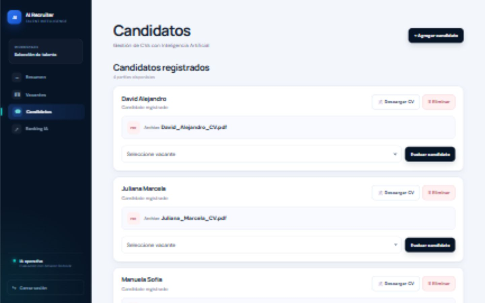
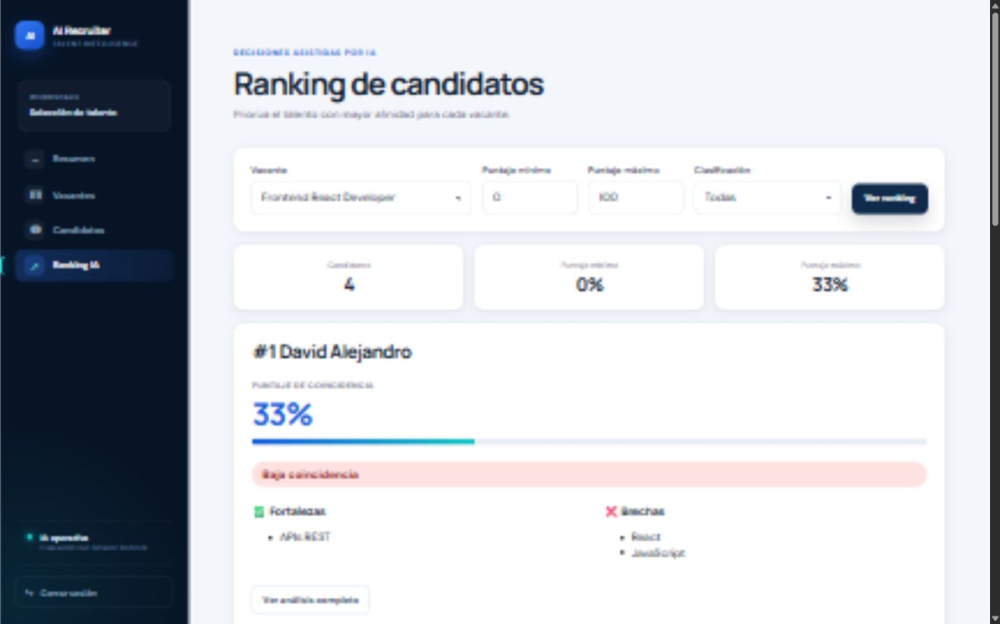
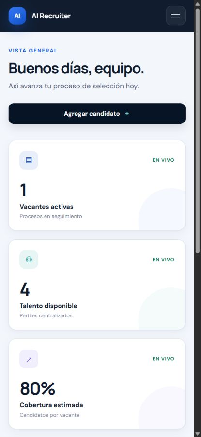
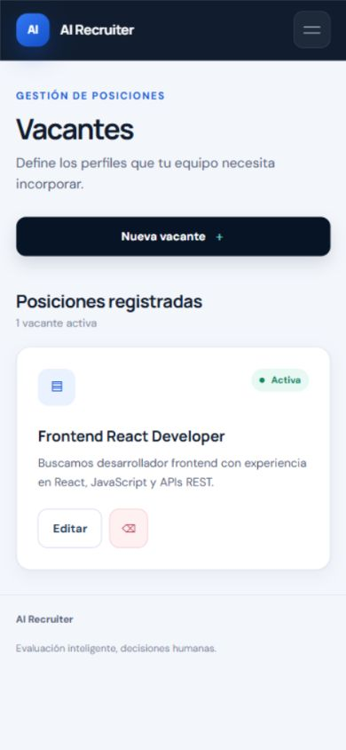
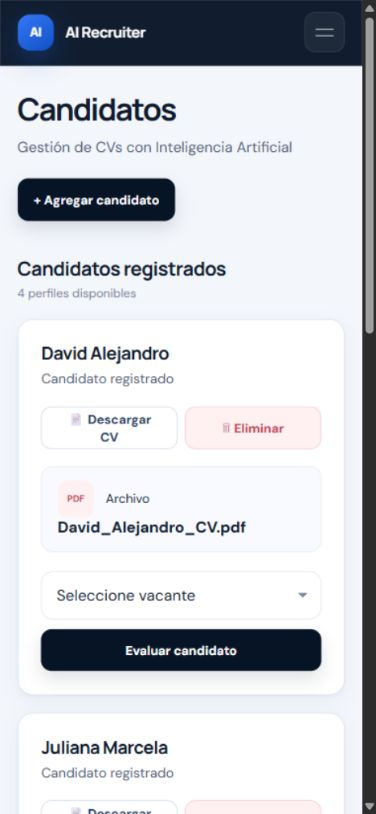
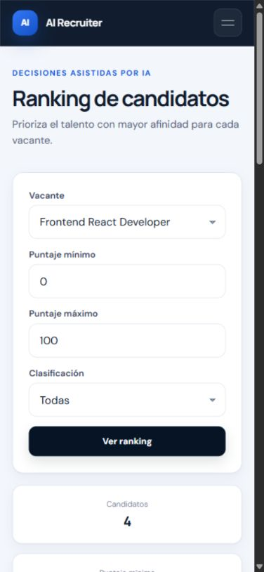
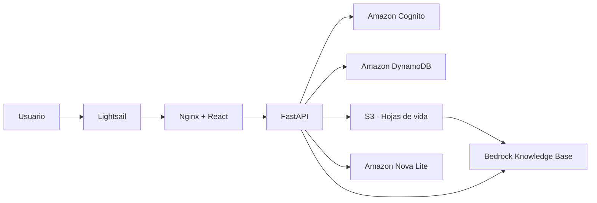

# AI Recruiter

Aplicación web para gestionar vacantes y candidatos, cargar hojas de vida en PDF y evaluar la afinidad de cada perfil mediante inteligencia artificial generativa en AWS.

La plataforma centraliza el proceso de selección: almacena los CV, los indexa en Amazon Bedrock Knowledge Bases y genera rankings, fortalezas, brechas, evidencias y recomendaciones para cada vacante.

**Aplicación:** [ai.adrianguerra.net](https://ai.adrianguerra.net)

## Capturas de pantalla

### Dashboard



### Vacantes



### Candidatos



### Ranking IA



### Versión móvil

| Dashboard | Vacantes |
| :---: | :---: |
|  |  |

| Candidatos | Ranking IA |
| :---: | :---: |
|  |  |

## Funcionalidades

- Registro, confirmación e inicio de sesión con Amazon Cognito.
- Gestión de vacantes por usuario.
- Carga, consulta, descarga y eliminación de CV en formato PDF.
- Indexación de documentos mediante Amazon Bedrock Knowledge Bases.
- Evaluación de candidatos contra los requisitos de una vacante.
- Ranking por puntaje y clasificación de coincidencia.
- Identificación de fortalezas, brechas y evidencia encontrada en el CV.
- Comparación y resumen de candidatos por vacante.
- Consulta del historial de evaluaciones.
- Aislamiento de vacantes y candidatos por propietario autenticado.

## Arquitectura



La aplicación se ejecuta en una instancia Lightsail con Docker Compose. Nginx sirve el frontend React y enruta `/api/*` al backend FastAPI en la misma instancia. Cognito, DynamoDB, S3 y Bedrock se mantienen como servicios administrados de AWS: contienen los datos actuales y no tienen un equivalente local compatible en Lightsail.

Para iniciar localmente la arquitectura simplificada:

```powershell
Copy-Item .env.example .env
# Completa las variables de Cognito y configura credenciales AWS para Boto3.
docker compose up --build -d
```

La aplicación queda disponible en `http://localhost` y la API en `http://localhost/api`.

## Tecnologías

### Frontend

- React 19
- Vite 8
- React Router
- Axios
- CSS

### Backend

- Python 3.10
- FastAPI
- Uvicorn
- Pydantic
- Boto3
- LangChain AWS

### AWS e infraestructura

- Amazon Cognito
- Amazon Bedrock y Amazon Nova Lite
- Bedrock Knowledge Bases
- Amazon S3
- Amazon DynamoDB
- Amazon Lightsail
- AWS CloudFormation

## Estructura del proyecto

```text
ai-recruiter/
|-- .github/workflows/       # CI/CD del frontend y de la API
|-- cognito-lambda/          # Funciones asociadas al flujo de Cognito
|-- frontend-react/          # SPA en React y Vite
|   |-- public/
|   `-- src/
|       |-- api/             # Cliente HTTP y token de acceso
|       |-- auth/            # Inicio de sesión y registro
|       |-- components/      # Layout, navegación y pie de página
|       `-- pages/           # Dashboard, vacantes, candidatos y ranking
|-- iam/                     # Políticas IAM para despliegue
|-- infra/                   # Infraestructura CloudFormation del frontend
|-- tests/                   # Pruebas del proyecto
|-- auth.py                  # Integración con Amazon Cognito
|-- main.py                  # API FastAPI y lógica de negocio
|-- Dockerfile               # Imagen del backend
|-- requirements.txt         # Dependencias de Python
`-- api-task-definition.json # Definición de tarea de ECS
```

## Requisitos

- Python 3.10 o superior compatible.
- Node.js 20 o superior y npm.
- Credenciales de AWS válidas disponibles para Boto3.
- Acceso a los recursos AWS configurados por la aplicación.
- Docker, opcional para ejecutar el backend en un contenedor.

## Configuración local

### 1. Clonar el repositorio

```bash
git clone <URL_DEL_REPOSITORIO>
cd ai-recruiter
```

### 2. Configurar el backend

En Windows PowerShell:

```powershell
py -3.10 -m venv .venv
.\.venv\Scripts\Activate.ps1
python -m pip install --upgrade pip
pip install -r requirements.txt
```

Crea un archivo `.env` en la raíz:

```dotenv
AWS_REGION=us-east-2
COGNITO_USER_POOL_ID=<user-pool-id>
COGNITO_CLIENT_ID=<app-client-id>
```

La aplicación obtiene las credenciales de AWS mediante la cadena de proveedores estándar de Boto3. Para desarrollo local puedes usar un perfil configurado con AWS CLI:

```powershell
aws configure
aws sts get-caller-identity
```

No almacenes claves de acceso, secretos ni tokens en Git.

Inicia la API:

```powershell
uvicorn main:app --reload --host 0.0.0.0 --port 8000
```

La documentación interactiva queda disponible en:

- Swagger UI: [http://localhost:8000/docs](http://localhost:8000/docs)
- OpenAPI: [http://localhost:8000/openapi.json](http://localhost:8000/openapi.json)
- Health check: [http://localhost:8000/api/health](http://localhost:8000/api/health)

### 3. Configurar el frontend

En otra terminal:

```powershell
cd frontend-react
npm ci
```

Crea `frontend-react/.env.local`:

```dotenv
VITE_API_URL=http://localhost:8000/api
```

Inicia Vite:

```powershell
npm run dev
```

Abre [http://localhost:5173](http://localhost:5173). El backend ya permite solicitudes CORS desde los puertos locales usados por Vite.

## Ejecución con Docker

Construye la imagen del backend:

```powershell
docker build -t ai-recruiter-api .
```

Ejecuta el contenedor:

```powershell
docker run --rm -p 8000:8000 --env-file .env ai-recruiter-api
```

El contenedor también necesita credenciales de AWS. En producción, ECS las proporciona mediante el rol de tarea; en desarrollo utiliza un mecanismo de credenciales seguro y evita incluir secretos en la imagen.

## Flujo principal

1. El usuario se registra o inicia sesión mediante Cognito.
2. Crea una vacante con su descripción y requisitos.
3. Carga el CV de un candidato en PDF.
4. La API almacena el documento y sus metadatos en S3.
5. Bedrock inicia la ingesta del documento en la base de conocimiento.
6. La aplicación recupera evidencia del CV y la compara con la vacante.
7. El resultado se guarda en DynamoDB y se presenta como puntaje, recomendación, fortalezas y brechas.

## API

Todas las rutas funcionales usan el prefijo `/api`. Salvo registro, inicio de sesión, confirmación y health check, los endpoints requieren el encabezado:

```http
Authorization: Bearer <access-token>
```

Grupos principales:

| Grupo | Capacidades |
| --- | --- |
| `/api/auth` | Registro, confirmación, login y validación de sesión |
| `/api/jobs` | Vacantes, evaluaciones, ranking, resumen y comparación |
| `/api/candidates` | Carga, consulta, descarga, eliminación y evaluación de candidatos |

Consulta Swagger UI para conocer los parámetros y esquemas vigentes de cada endpoint.

## Validación

### Backend

```powershell
python -m py_compile main.py auth.py
```

Los scripts `test_kb.py` y `test_multi_kb.py` realizan pruebas de integración contra la base de conocimiento configurada y, por tanto, pueden consumir servicios AWS.

### Frontend

```powershell
cd frontend-react
npm run lint
npm run build
```

## Despliegue

El repositorio contiene dos flujos de GitHub Actions:

- **API CI/CD:** valida Python y Docker, publica la imagen en Amazon ECR, registra una nueva definición de tarea y actualiza el servicio de ECS.
- **Frontend CI/CD:** instala dependencias, compila React, sincroniza los archivos con S3 e invalida la distribución de CloudFront.

Los despliegues de producción se ejecutan al enviar cambios a `main` en las rutas correspondientes. Las credenciales de GitHub se intercambian por permisos temporales de AWS mediante OIDC; el entorno de producción debe definir `AWS_DEPLOY_ROLE_ARN` como variable del repositorio o del entorno.

La plantilla `infra/frontend-static.yml` administra el bucket privado del frontend, el Origin Access Control, la distribución de CloudFront, la reescritura de rutas de la SPA y la conexión HTTPS con el origen de la API.

## Seguridad

- La API valida tokens JWT emitidos por Cognito.
- Los registros se filtran por el identificador del usuario autenticado.
- El bucket del frontend bloquea el acceso público y CloudFront usa Origin Access Control.
- El backend obtiene permisos mediante roles IAM, sin credenciales incrustadas en la imagen.
- Los secretos y valores sensibles deben mantenerse fuera del repositorio.

## Licencia

Este repositorio no declara una licencia. Añade un archivo `LICENSE` antes de permitir redistribución o uso por terceros.
